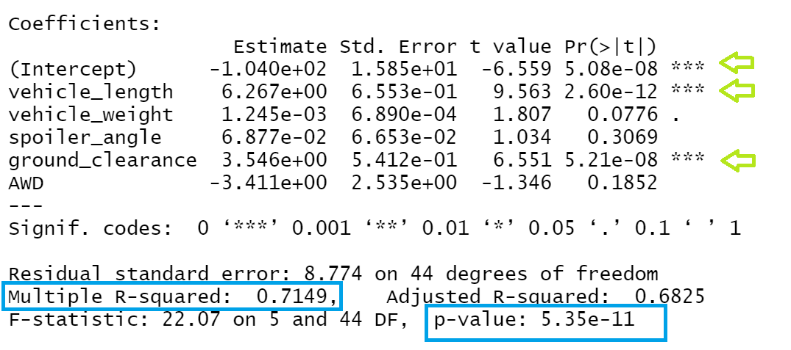

# MechaCar_Statistical_Analysis

## Linear Regression to Predict MPG

*According to the R-Analysis, the vehicle_length and the ground_clearance are the variables that are statistically unlikely to provide random amounts of variance to the linear model. Also, the intercept is statistically significant, so when all the variables independents are equal to zero, the intercept shows a significant amount of variability in the dependent variable.

*As we see in the R-analysis, the p-value is 5.35e-11, which means is very small so, the slope can't be considered to be zero. According to the null hypothesis, the independent variables don't have a relation with the dependent variable (MPG), but the null hypothesis has been rejected because the p-value is smaller than .05 so it shows significance.

*The R-squared shows a high result, 71%, which means that the linear regression model (independent variables) explains 71% of the change of the dependent variable( MPG).So according to this, this lineal model predicts the MPG of mechaCar prototypes effectively.

## Summary Statistics on Suspension Coils

*Above, we can observe the summary of suspension Coils, in total the variance is 62.29, below that the design specifications, also in the individual lot summary we can observe each lot variance lot 1, lot 2 and lot 3, their variance are 0.98, 7.47 and 170.29 respectively, so lot 1 and lot 2 accomplish the design specifications while lot 3 don´t do it. 

## T-Tests on Suspension Coils

*According to the t-test analysis, the p-value shows a result of 0.06, so, the PSI across all manufacturing lots is not statically different from the population mean of 1,500 pounds per square inch, which means, we do not reject the null hypothesis.

*We can see that the PSI for manufacturing lot1 is not statistically different from the population mean of 1,500 pounds per square inch, based on the p-value result that is 1. So, we do not reject the null hypothesis.

*In this case, we also observe a p-value result over 0.05, 0.6, it means that the PSI for manufacturing lot2 is not statistically different from the population mean of 1,500 pounds per square inch, we do not reject the null hypothesis.

*In this last t-test, we observe a p-value less than 0.05, 0.04, which means that the PSI for manufacturing lot3 is statistically different from the population mean of 1,500 pounds per square inch, in this unique case, we reject the null hypothesis.

## Study Design: MechaCar vs Competition

1)Metric
In this model, we are going to test the cost of the vehicles from MechaCar against the top competitor's costs. Because is one of the most important variables for the customers.

2)Null hypothesis and alternative hypothesis
H₀= There is no statistical difference between the two observed sample means.
Hₐ= There is a statistical difference between the two observed sample means.

3)Statistical test 
We are going to use the two-Sample t-test to analyze if there is a statistical difference between the distribution means from two samples.

4)Data is needed to run the statistical test
We need the cost of the vehicles from MechaCar and the cost of vehicles from the top competitors.
